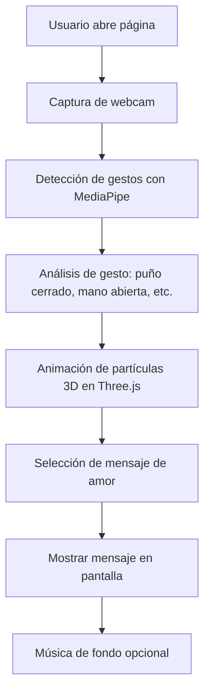

# Plan para Página Web Interactiva Romántica con Gestos de Mano y Partículas 3D

## Descripción General
Crear una página web que detecte gestos de la mano en tiempo real usando la webcam, anime partículas 3D con Three.js, y muestre mensajes de amor personalizados basados en los gestos.

## Tecnologías Seleccionadas
- **Detección de Mano**: MediaPipe (precisa y robusta)
- **Renderizado 3D**: Three.js
- **Estructura**: HTML5, CSS3, JavaScript ES6+
- **Compatibilidad**: Navegadores modernos con soporte para WebGL y getUserMedia

## Arquitectura del Sistema

## Lista de Tareas
- [ ] Investigar y seleccionar bibliotecas: MediaPipe para detección de mano, Three.js para partículas 3D
- [ ] Crear estructura de proyecto: index.html, styles.css, script.js
- [ ] Implementar HTML básico con elementos para webcam, canvas 3D, área de mensajes
- [ ] Diseñar CSS responsivo con temas de colores cálidos (rojos, rosas)
- [ ] Implementar captura de webcam en JavaScript
- [ ] Integrar detección de gestos de mano con MediaPipe
- [ ] Crear animación de partículas 3D que respondan a movimientos de mano (flujo, formas de corazón)
- [ ] Definir colección de mensajes de amor predefinidos y lógica para cambiar según gestos (puño cerrado: apasionado, mano abierta: tierno)
- [ ] Agregar música de fondo opcional con controles
- [ ] Probar compatibilidad con navegadores modernos
- [ ] Crear instrucciones de implementación y posibles mejoras

## Mejoras Futuras
- Generación de mensajes usando IA
- Más gestos reconocidos
- Efectos de sonido
- Modo offline
- Personalización de temas

## Instrucciones de Implementación
1. Clonar o descargar los archivos
2. Abrir index.html en un navegador moderno
3. Permitir acceso a la webcam
4. Interactuar moviendo la mano frente a la cámara
